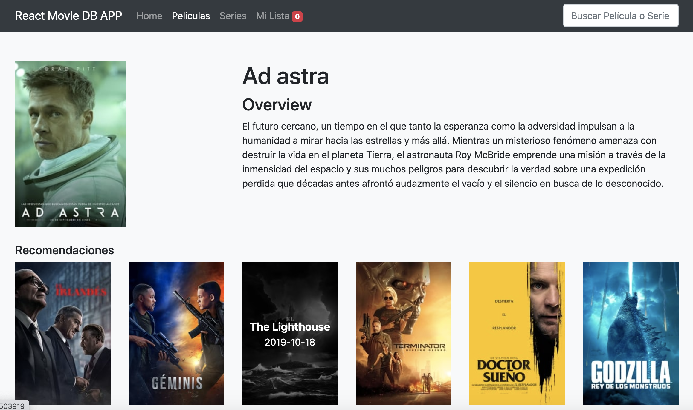

# web_advmovies

App with react to retrieve info for movies

# Install

- ``npm install``

- ``npm start``
  
# Stack
 React, Redux, Redux Form, React Router, StyledComponents, PropTypes, classnames
 

    

